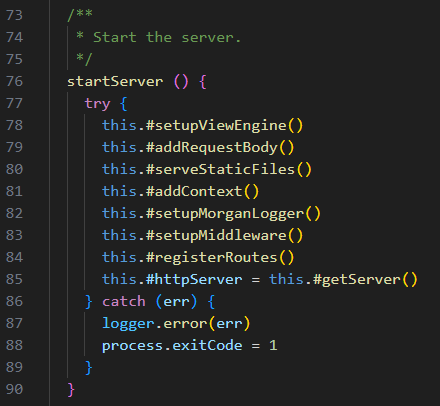

# Reflektioner

## Kapitel 2 Meaningful Names

## Kapitel 3 Functions

Något som jag inte har tänkt så mycket på är abstraktionsnivåerna. **One Level of Abstraction per Function** har hjälpt mycket med att göra funktioner till en läsbar lista med steg. Om jag har skrivit en funktion med hög abstraktionsnivå vill jag helst inte lägga till rader med låg abstraktion, för då blir det svårare att läsa. Vissa funktioner har då bara en rad kod, och i början kändes det onödigt att ha så korta funktioner, men det lönar sig.

## Kapitel 4 Comments

## Kapitel 5 Formatting

## Kapitel 6 Objects and Data Structures

## Kapitel 7 Error Handling

## Kapitel 8 Boundaries

## Kapitel 9 Unit Tests

## Kapitel 10 Classes

## Kapitel 11 Systems
